# Foodies

Do you feel like ordering meals online? Purchase with Foodies. You may place online meal orders with the Foodies website.
Foodies is a website in which you can order food online and get it delivered for free.
If you want to your restaurant to be on foodies then you can apply for restaurant on foodies.

## Features

> 1.  Login and Register.
> 2.  View restaurants.
> 3.  View menu of respective restaurants.
> 4.  Add food item to cart.
> 5.  View Cart.
> 6.  Checkout.
> 7.  Order history.
> 8.  Profile.
> 9.  Apply for restaurant.

## Features for restaurant owner

> 1.  Add food item to menu.
> 2.  View food items.
> 3.  View orders.
> 4.  View restaurant profile.
> 5.  Update restaurant profile.
> 6.  Update food item.
> 7.  Delete food item.
> 8.  Delete restaurant.

## Features for admin

> 1.  View all restaurants
> 2.  Verification of restaurant
> 3.  View all applied applications for registering restaurant.
> 4.  Manage users and there roles

## Tech Stack

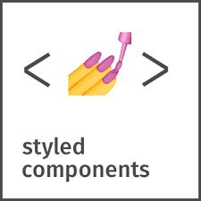

> - React
> - Node JS
> - Typescript
> - Mongodb
> - Razorpay
> - Styled Components
> - Nodemailer
> - Passport JS
> - Express
> - Redux
> - Axios
> - Mapbox
> - Socket IO

## Screenshots

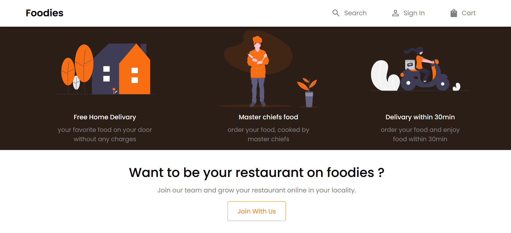

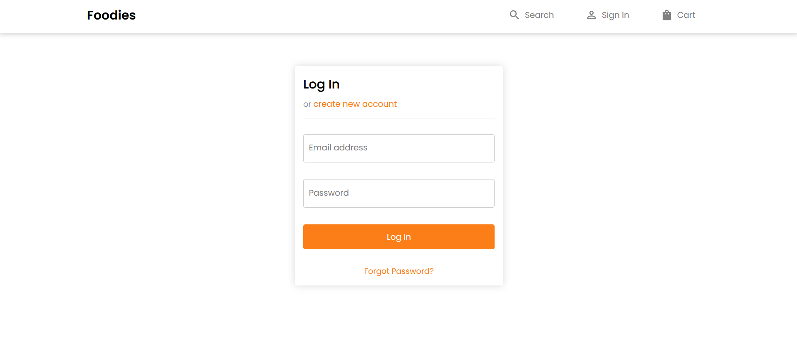

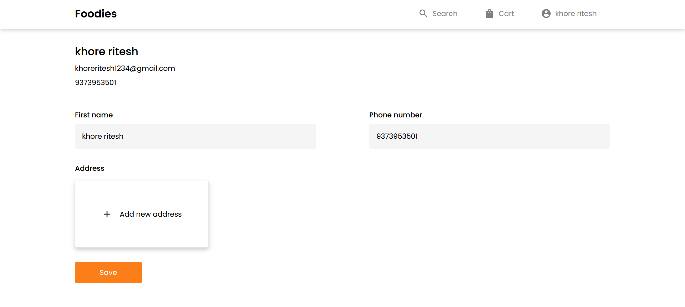

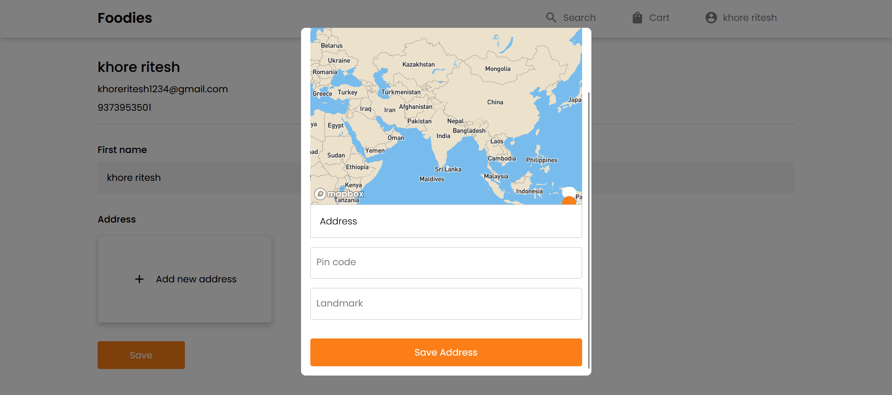

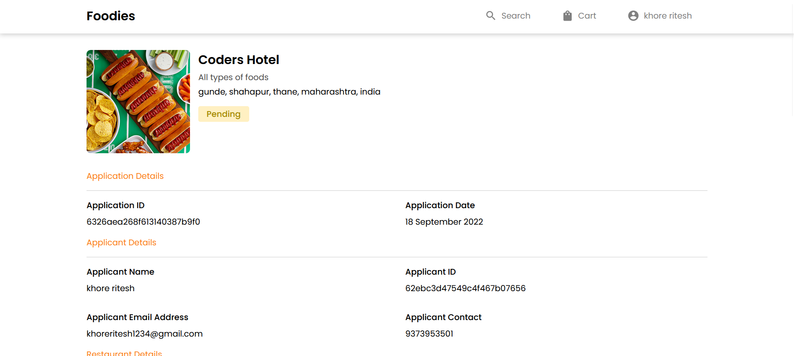

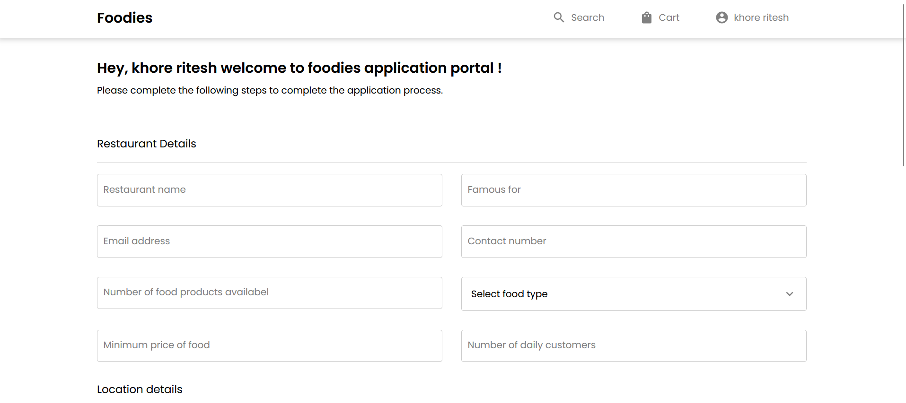

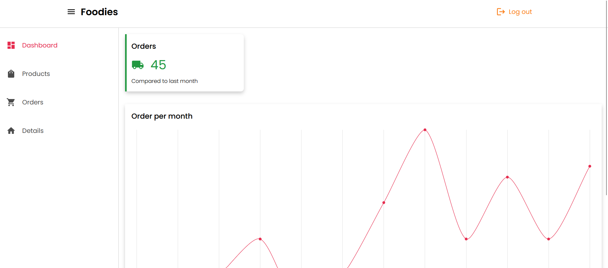

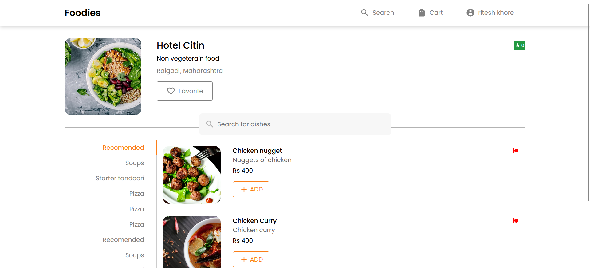

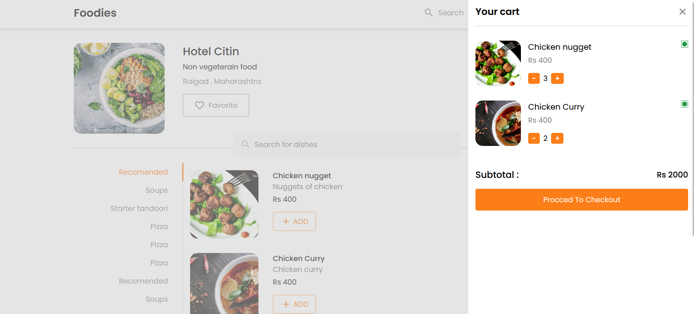

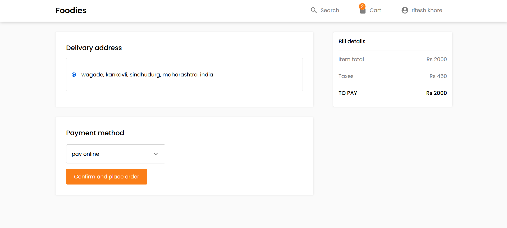

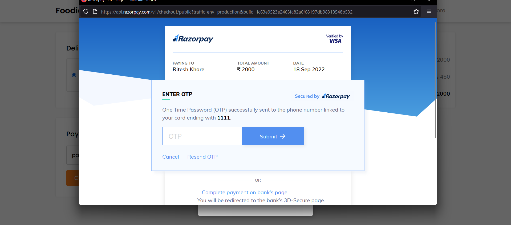

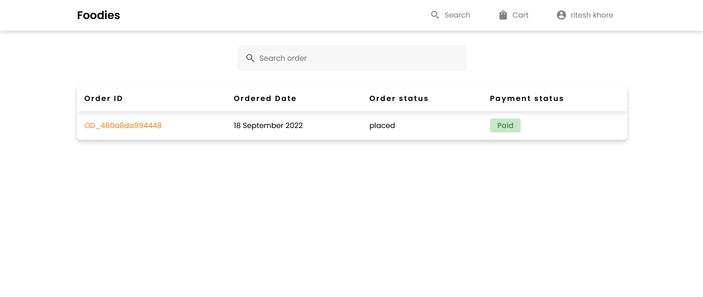

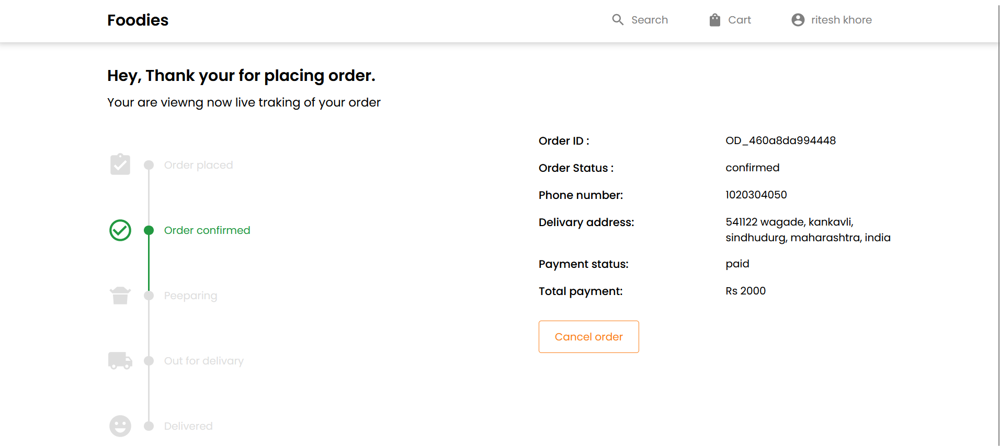

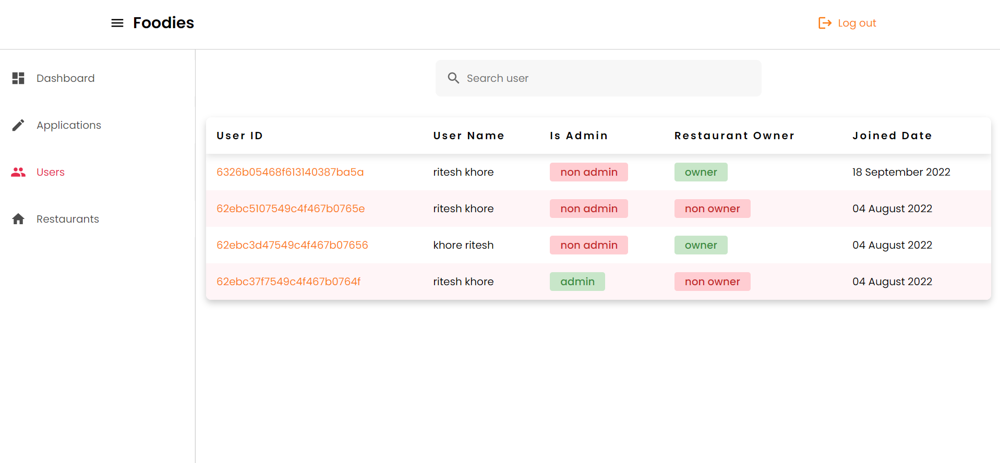

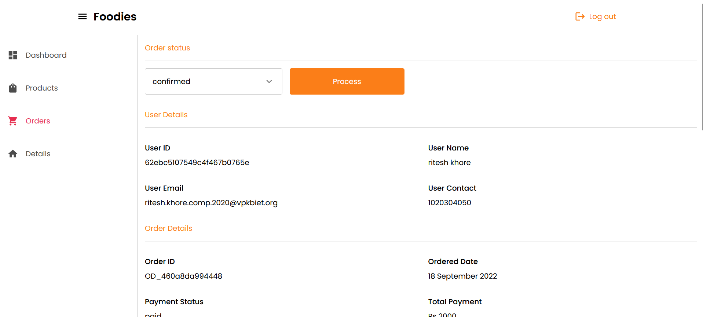
